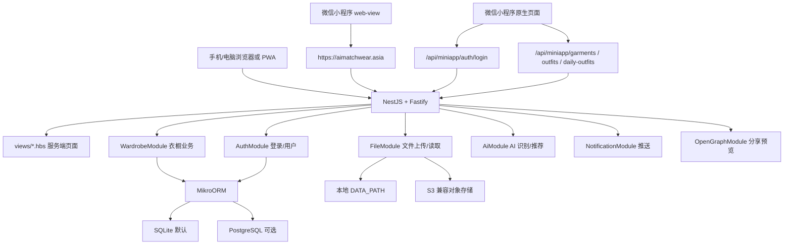
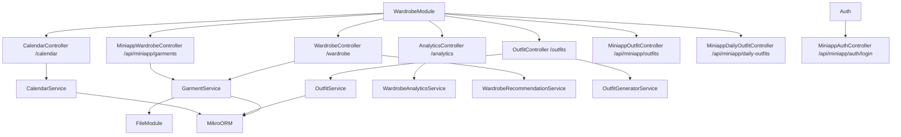
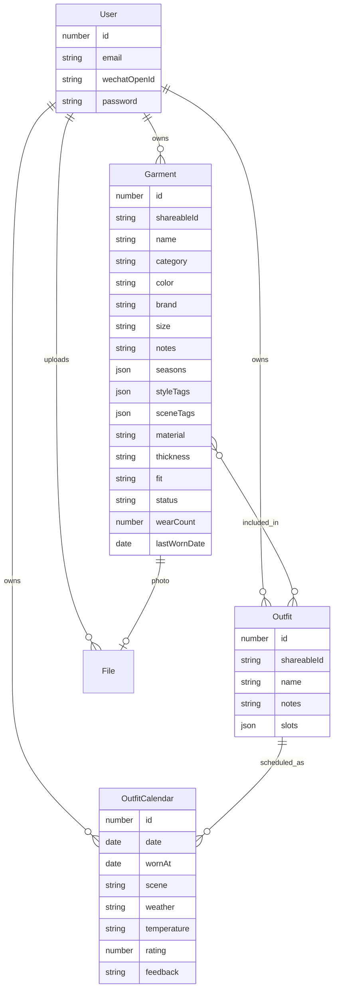
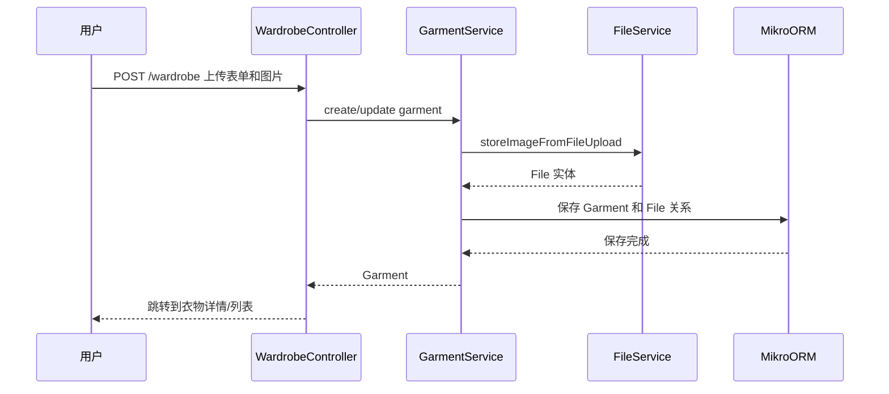
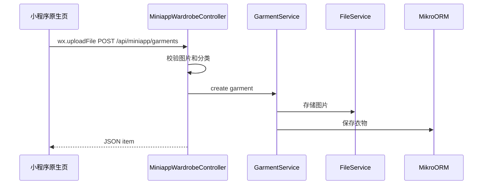
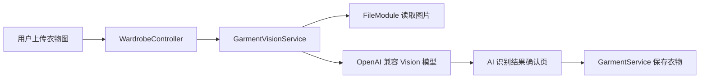

# AI 穿搭衣橱架构 Handoff 手册

> 给小程序架构工程师看的架构交接文档。  
> 更新时间：2026-06-16  
> 代码目录：`C:\Users\Administrator\Desktop\AI穿搭软件\Libre-Closet`

## 1. 一句话概览

这个项目目前不是纯原生小程序，而是“后端 Web 应用 + PWA + 微信小程序入口”的混合架构。

大白话说：

- 主体能力在 NestJS 后端里：衣物管理、搭配管理、日历、AI 识别、文件上传、用户登录、数据库。
- Web 端页面由后端直接渲染 Handlebars 模板，配合 HTMX 做局部交互。
- 小程序目前有两种形态：
  - `pages/webview/index`：打开线上 Web 应用的 web-view 壳。
  - `pages/wardrobe`、`pages/garment-form`、`pages/garment-detail`：少量原生小程序页面，调用后端 `/api/miniapp/garments` 接口。

## 2. 技术栈

| 层级 | 技术 |
| --- | --- |
| 后端框架 | NestJS 11 |
| HTTP 引擎 | Fastify |
| 页面渲染 | Handlebars / hbs |
| 前端增强 | HTMX、hyperscript、SortableJS、PullToRefresh |
| 样式 | Tailwind CSS 4、DaisyUI |
| 数据库 ORM | MikroORM |
| 数据库 | SQLite 默认，可切 PostgreSQL |
| 文件存储 | 本地磁盘默认，可切 S3 兼容对象存储 |
| 图片处理 | sharp、@imgly/background-removal |
| AI 接入 | Qwen/OpenAI 兼容接口。生产环境当前使用 `QWEN_API_KEY`、`QWEN_API_BASE_URL`、`QWEN_TEXT_MODEL`、`QWEN_VISION_MODEL`；旧 OpenAI 兼容配置仍可能在部分代码路径中保留 |
| 图片分割 | 阿里云图片分割，生产环境依赖 `BG_REMOVAL_PROVIDER=aliyun`、`ALIBABA_CLOUD_ACCESS_KEY_ID`、`ALIBABA_CLOUD_ACCESS_KEY_SECRET`、`ALIYUN_IMAGE_SEG_*` |
| 小程序 | 微信小程序原生页面 + web-view |
| 测试 | Jest、Playwright、miniapp shell 校验脚本、Lighthouse |

## 3. 顶层目录说明

```text
Libre-Closet/
  src/                 NestJS 后端源码
  views/               Handlebars 服务端渲染页面
  public/              静态资源、浏览器 JS、PWA manifest
  miniprogram/         微信小程序代码
  docs/                项目文档
  scripts/             构建、校验、测试辅助脚本
  test/                Playwright E2E 测试
  docker/              Docker 构建文件
```

## 4. 总体架构图



## 5. 后端模块边界

入口文件：

- `src/main.ts`：创建 Nest Fastify 应用，注册 cookie、压缩、multipart、静态资源、Handlebars 视图引擎、Handlebars helper。
- `src/app.module.ts`：全局模块组装、环境变量校验、日志、i18n、限流、错误页面过滤器、数据库迁移启动。

主要模块：

| 模块 | 位置 | 职责 |
| --- | --- | --- |
| `DalModule` | `src/dal` | 数据库连接、SQLite/PostgreSQL 切换、迁移配置 |
| `AuthModule` | `src/auth` | 登录、注册、JWT、条件鉴权 |
| `FileModule` | `src/file` | 图片上传、文件读取、本地/S3 存储切换、图片水印/压缩 |
| `WardrobeModule` | `src/wardrobe` | 衣物、搭配、穿搭日历、统计、推荐、小程序 API |
| `AiModule` | `src/ai` | 衣物图片识别、搭配推荐文本生成 |
| `NotificationModule` | `src/notification` | Web Push 设备和通知 |
| `OpenGraphModule` | `src/open-graph` | 分享链接的预览图/元信息 |
| `ViewContextModule` | `src/view-context` | 给所有页面注入全局视图上下文 |

## 6. WardrobeModule 内部结构

`WardrobeModule` 是当前业务核心。



主要路由：

| 路由 | 用途 |
| --- | --- |
| `/wardrobe` | Web 衣物列表、筛选、新增、编辑、AI 识别、去背景 |
| `/outfits` | Web 搭配列表、新增、编辑、推荐 |
| `/calendar` | Web 穿搭日历、标记已穿、删除日历记录 |
| `/analytics` | Web 衣橱统计 |
| `/api/miniapp/auth/login` | 小程序用 `wx.login` code 换后端 JWT，后端按微信 `openid` 绑定 User |
| `/api/miniapp/garments` | 小程序原生页面用的衣物列表、详情、上传、删除 API |
| `/api/miniapp/garments/analyze` | 小程序上传图片后获取 AI 可编辑草稿，不直接保存 |
| `/api/miniapp/garments/backup/export` | 导出衣橱 ZIP 备份包，包含 `manifest.json` 与照片 |
| `/api/miniapp/garments/backup/import` | 导入本项目导出的 ZIP 备份包，恢复衣物信息和照片 |
| `/api/miniapp/outfits/recommend` | 小程序 AI 搭配推荐，按当前微信用户的衣橱生成 |
| `/api/miniapp/daily-outfits` | 小程序保存今日穿搭，按当前微信用户隔离 |
| `/api/miniapp/daily-outfits/today` | 小程序读取今日穿搭，按当前微信用户隔离 |

## 7. 数据模型

核心实体在 `src/dal/entity`。



说明：

- `Garment` 表示一件衣服。
- `Outfit` 表示一套搭配，可以包含多件衣服。
- `OutfitCalendar` 表示某天计划穿哪套搭配，以及是否已经穿过、评价如何。
- `File` 存图片文件元信息，真实图片在本地磁盘或 S3。
- 多用户隔离依赖 `owner` 字段；小程序原生页通过微信 `openid` 绑定到 `User.wechatOpenId`，再把 JWT 放到 `Authorization: Bearer ...` 请求头里。
- 如果没有 token 且 `AUTH_ENABLED=false`，后端仍兼容单用户自托管模式，会访问 `owner=null` 的旧数据。

## 8. 小程序现状

### 8.1 小程序目录

```text
miniprogram/
  app.json
  app.wxss
  utils/api.js
  pages/webview/
  pages/wardrobe/
  pages/garment-form/
  pages/garment-detail/
```

### 8.2 web-view 入口

`miniprogram/pages/webview/index.js` 当前打开：

```text
https://aimatchwear.asia
```

这个路径适合快速上线，因为 Web 端已有完整功能。限制是：体验、登录态、上传、域名白名单、微信能力调用都受 web-view 规则影响。

### 8.3 原生小程序页面

原生页面当前只覆盖衣物管理的基础链路：

- 衣物列表：`pages/wardrobe/index`
- 新增衣物：`pages/garment-form/index`
- 衣物详情：`pages/garment-detail/index`
- AI 搭配：`pages/outfit/index`
- 今日穿搭：`pages/daily-outfit/index`

它们通过 `miniprogram/utils/api.js` 请求线上后端：

```text
POST   /api/miniapp/auth/login
GET    /api/miniapp/garments
GET    /api/miniapp/garments/:id
POST   /api/miniapp/garments
DELETE /api/miniapp/garments/:id
POST   /api/miniapp/outfits/recommend
POST   /api/miniapp/daily-outfits
GET    /api/miniapp/daily-outfits/today
```

当前原生小程序尚未覆盖：

- 搭配管理原生化
- 完整穿搭日历原生化
- 统计页原生化

## 9. 关键请求链路

### 9.1 Web/PWA 衣物上传



### 9.2 小程序原生衣物上传



### 9.3 AI 衣物识别



## 10. 配置和运行方式

常用配置在 `.env` / `.env.local`，`src/app.module.ts` 里用 Joi 做校验和默认值。

重点配置：

| 配置 | 说明 |
| --- | --- |
| `PORT` | 服务端口，默认 3000 |
| `APP_NAME` | 应用显示名称，当前默认偏中文 |
| `AUTH_ENABLED` | 是否开启登录和用户隔离 |
| `ACCESS_TOKEN_SECRET` | JWT 签名密钥，生产必须改成强随机字符串 |
| `WECHAT_MINIAPP_APP_ID` | 微信小程序 AppID，用于小程序登录 |
| `WECHAT_MINIAPP_APP_SECRET` | 微信小程序 AppSecret，用于 `code2Session` 换 `openid` |
| `DATA_PATH` | SQLite 数据库和本地文件的存放目录 |
| `DATABASE_TYPE` | `sqlite` 或 `postgres` |
| `FILE_STORAGE_TYPE` | `local` 或 `object` |
| `OPENAI_API_KEY` | AI 能力需要 |
| `AI_API_BASE_URL` | OpenAI 兼容接口地址 |
| `AI_TEXT_MODEL` | 文本推荐模型 |
| `AI_VISION_MODEL` | 图片识别模型 |

开发常用命令：

```powershell
npm.cmd install
npm.cmd run start:dev
npm.cmd test
npm.cmd run test:miniapp
npm.cmd run build
```

## 11. 架构上值得工程师重点看的点

### 11.1 小程序路线选择

当前同时存在 web-view 和少量原生页面。建议请架构工程师判断：

- 继续走 web-view 为主，原生只做入口和微信能力增强？
- 还是逐步把核心链路改成原生小程序，后端只提供 API？
- 如果做原生化，是否需要先补完整 REST API，而不是复用服务端渲染 Controller？

### 11.2 登录态和用户体系

Web 端已有 JWT/条件鉴权；小程序原生页现在通过 `wx.login` -> `/api/miniapp/auth/login` -> 微信 `code2Session` 拿到 `openid`，再绑定或创建 `User.wechatOpenId`。后续小程序请求统一带 `Authorization: Bearer ...`，衣橱、搭配推荐、今日穿搭继续复用现有 `owner` 隔离。

建议评审：

- 小程序 token 过期后的刷新体验是否需要更细的提示。
- Web JWT、微信 JWT、自托管无登录模式三者是否继续共用 `ConditionalAuthGuard`。
- 微信用户是否未来需要绑定邮箱账号或迁移旧 `owner=null` 数据。

### 11.3 API 分层

目前 Web Controller 和小程序 API Controller 共用 Service，这是好事；但小程序 API 还比较少。

建议评审：

- 是否建立稳定的 `/api/v1/...` API 层。
- Web 页面 Controller 和 API Controller 是否继续分开。
- DTO 和返回结构是否需要固定版本，方便小程序长期迭代。

### 11.4 文件上传和图片处理

图片上传走 Fastify multipart，存储层通过 `FileService` 抽象切换本地/S3。

建议评审：

- 小程序上传文件大小限制、压缩策略、失败重试。
- 去背景模型资源在 Web 侧加载，对小程序原生是否需要后端化处理。
- 线上是否用本地磁盘还是对象存储，备份策略如何做。

### 11.5 数据库和部署

默认 SQLite，启动时自动跑 MikroORM migration。对于单用户或小规模使用很简单。

建议评审：

- 正式生产是否继续 SQLite。
- 如果多用户增长，什么时候切 PostgreSQL。
- 自动迁移是否适合生产环境，还是改成发布流程手动迁移。

### 11.6 AI 能力边界

AI 模块已经拆出来，但业务入口主要在衣物识别和搭配推荐。

建议评审：

- AI 调用是否需要队列，避免上传时同步等待太久。
- 是否需要保存 AI 原始结果和人工确认结果，方便回溯。
- 是否需要对模型供应商做更明确的适配层。

## 12. 当前风险清单

| 风险 | 影响 | 建议 |
| --- | --- | --- |
| 小程序有 web-view 和原生页面两条路线 | 产品体验和技术路线容易摇摆 | 先决定“小程序长期是否原生化” |
| 原生小程序 API 覆盖不完整 | 原生化会卡在登录、搭配、日历、AI | 先补 API 设计文档，再逐步迁移 |
| 小程序 token 依赖微信 AppID/AppSecret | 服务器缺少环境变量时，原生小程序登录会失败 | 部署前确认 `.env` 含 `WECHAT_MINIAPP_APP_ID` 和 `WECHAT_MINIAPP_APP_SECRET` |
| 默认 SQLite + 本地文件 | 部署简单，但扩容和备份要提前想 | 生产环境明确备份、对象存储、迁移策略 |
| 启动自动跑 migration | 简单方便，但生产发布可控性弱 | 评估是否改为 CI/CD 或运维手动迁移 |
| AI 同步调用可能慢 | 上传/推荐体验可能等待较久 | 评估异步任务、状态轮询、超时降级 |

## 13. 建议让架构工程师回答的问题

1. 小程序未来应该是 web-view 为主，还是原生为主？
2. 如果原生为主，后端 API 应该如何分层和版本化？
3. 微信用户是否需要绑定 Web 邮箱账号，旧公共衣橱数据是否要迁移到指定微信用户？
4. 图片上传、压缩、去背景，哪些放小程序端，哪些放后端？
5. SQLite 是否满足当前上线阶段？什么时候需要 PostgreSQL？
6. 文件是继续本地存，还是尽早切对象存储？
7. AI 调用是否需要异步任务队列？
8. 当前模块拆分是否足够，是否需要单独的 MiniappModule？

## 14. 我的理解和推荐方向

如果目标是“尽快可用、少返工”，建议先定一条主线：

- 短期：保留 web-view 作为完整功能入口，原生小程序只补最重要的衣物上传/查看体验。
- 中期：把后端 API 规范化为 `/api/v1`，让原生小程序逐步接入衣物、搭配、日历、AI。
- 长期：如果小程序体验很重要，再把登录、上传、搭配推荐、日历完整原生化；Web/PWA 继续作为管理端和备用入口。

这样做的好处是：现在已有的 Web 能力不会浪费，小程序也能一步步变强，不需要一次性推翻重写。
