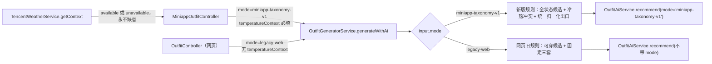

# 小程序穿搭出口与调用模式收敛 PLAN

- 阶段：P3
- 最后更新：2026-08-16
- 上游：已获认可的 `docs/spec.md`、2026-08-13 P5 Spec 审查的 3 项 finding、2026-08-16 P5 Standards 审查的 1 项 finding

## 1 目标与非目标

### 上游条目索引

| 编号 | 类型 | 上游位置 | 条目 |
|---|---|---|---|
| MVP-01 | MVP 做 | SPEC 第 2 章第 1 项 | 小程序穿搭推荐使用有效搭配标签：同组优先采用新的结构化标签，缺失时才使用历史字段。 |
| MVP-04 | MVP 做 | SPEC 第 2 章第 4 项 | 一次返回零至三套有实际差异的完整或部分方案；允许所有库存状态的衣物参与，推荐非可穿状态衣物时显示状态提醒。 |
| MVP-05 | MVP 做 | SPEC 第 2 章第 5 项 | 定位被拒绝或天气数据不可用时继续生成，并明确提示本次没有使用实时温度。 |
| AC-03 | 验收标准 | SPEC 第 3 章第 3 项 | 明确需求或冲突核心仍被保留，同时看到真实温度注意事项。 |
| AC-04 | 验收标准 | SPEC 第 3 章第 4 项 | 天气降级时仍返回零至三套，并显示未使用实时温度的提示。 |
| AC-05 | 验收标准 | SPEC 第 3 章第 5 项 | 非可穿状态衣物有状态提醒，方案不重复，缺少合适单品时允许部分方案。 |
| BUG-06 | P5 Spec Finding | 生成器本地方案与 Controller | AI 失败或 fallback 为空时，本地方案没有状态/温度提醒，Controller 又固定输出空 `cautions`。 |
| BUG-07 | P5 Spec Finding | 生成器小程序 AI 方案出口 | AI 成功方案没有调用整套颜色关系计算，用户理由缺少动态色彩依据。 |
| BUG-08 | P5 Spec Finding | Controller 到生成器的空衣橱路径 | 带天气请求的空衣橱绕过 Controller 早退，生成器因没有核心衣物抛 `NotFoundException`，没有返回合法的 0 套结果。 |
| BUG-09 | P5 Standards Finding | `src/wardrobe/recommendation/outfit-generator.service.ts:78` | 用 `Boolean(input.temperatureContext)` 隐式代表小程序新版规则模式；天气字段缺省时静默退回网页旧规则，返回 HTTP 200 但产品行为被降级。 |
| BUG-10 | P5 双轴 Finding B01（2026-08-16） | `src/wardrobe/recommendation/outfit-generator.service.ts:310-355` | `attachAiGarments` 的网页（legacy）分支被 TASK-01b 追加了小程序专用后处理，改变了网页 AI 输出。经核实实际可达的行为改变为两处：AI 理由被追加整套颜色关系文案；AI 方案被 `.slice(0, 3)` 截断。另有三段在 legacy 永不可达的死代码（`seenPlans`、两处 `miniappMode &&` 判断、`!garmentIds.length` 丢弃——因 `core` 必被 unshift 而不可达）。违反 HC-01。 |
| BUG-11 | P5 双轴 Finding B02（2026-08-16） | `src/wardrobe/recommendation/outfit-generator.service.ts:106-111` | 默认核心衣物选择分支 `(wearable[0] ?? orderedGarments[0])` 没有 `mode` 判别，网页模式也能选到非可穿衣物当核心；`coreGarmentId` 由 fixed point 的必填被放宽为两个模式共同可选。SPEC 硬约束 5 把该规则限定为小程序新版规则。三条 spec 用例以 `mode: 'legacy-web'` 正面锁定了这一错误行为。 |
| BUG-12 | P5 双轴 Finding B03（2026-08-16） | `src/wardrobe/recommendation/outfit-generator.service.ts:620-658` | `temperatureCautions` 只检查核心衣物且完全不读 `requestText`（形参声明未使用）。用户明确要求保暖/凉爽时，冲突的**非核心**单品因 `explicitWarm/explicitCool` 免于被排除并进入方案，却不产生任何温度注意事项，AC-03 的第一个触发条件（「明确要求保暖」）没有承载体。 |

### 继承自上游的硬约束

| 编号 | 上游原文 |
|---|---|
| HC-01 | 第一版只改变微信小程序穿搭推荐的用户体验，网页端衣橱搜索保持原样。 |
| HC-02 | 未来八小时最高温严格大于 25℃ 才触发高温排除；最低温不高于 10℃ 才触发低温排除；缺少相关标签时不得推断为冲突。 |
| HC-03 | 用户明确表达的需求高于实时温度；用户指定的核心衣物不得因温度冲突被替换，只能增加注意事项。 |
| HC-04 | 新结构化标签按组优先，旧字段仅在同组新标签缺失时兜底；每组权重相同且最多计算一次；穿着体验不参与推荐，色彩关系按整套衣物动态判断。 |
| HC-05 | 所有库存状态的衣物都可参与推荐；非可穿状态必须提示，默认核心衣物优先选择最新的可穿衣物，没有可穿衣物时才选择其他状态的最新衣物。 |
| HC-06 | 用户未授权定位或温度不可用时不得阻止生成、静默猜测城市或使用默认城市；手动城市只保存在当前设备，并允许切回自动定位。 |
| HC-07 | 一次最多返回三套有实际差异的方案，允许少于三套和部分方案；不得用明显不合适的衣物强行补齐。 |
| HC-08 | 新版推荐对目标账号正式启用前，必须完成剩余十一件衣物的 AI 分析和补标时间记录，并完成人工数据核对；不要求每件衣物的所有标签组都有值。 |

### 目标

1. 建立一个真正覆盖本地规则方案和小程序 AI 方案的最终归一化出口，统一追加状态提醒、核心温度提醒和整套颜色关系；Controller 只映射，不制造第二个出口。（已由 TASK-01a/01b、TASK-02a/02b 完成）
2. 让「用哪套推荐规则」成为生成器入口的显式命名契约，让「本次是否拿到实时温度」回到纯数据事实的位置；两者不得互相推断。
3. 让小程序入口在任意客户端版本、任意天气模式下都稳定使用新版小程序规则，并合法返回零至三套方案。

### 非目标

- 不修改 `docs/spec.md`、标签定义、温度阈值、天气产品行为或小程序页面与前端契约。
- 不改变网页旧模式的固定三套、可穿过滤或 AI fallback 合同。
- 不修改 `OutfitAiService` 的提示词与解析、腾讯天气服务、数据库、部署流程或生产数据。
- 不把生成器内部已有的 `miniappMode` 布尔参数线程重构掉，也不拆分出独立的小程序生成器类；本轮只修入口契约。
- 不提交、不推送、不部署，不执行剩余 11 件衣物补标或微信开发者工具人工验收。

## 2 现状调查

- 当前分支 `feature/outfit-taxonomy-consumption`，`HEAD=47e422e0ffc4c698f1eea00842d6418cb5104dc1`；全部施工仍在未提交工作树中。（命令：`git branch --show-current; git rev-parse HEAD; git status --short`）
- 目标 1 已落地：`GeneratedOutfitPlan.cautions` 已存在于 `src/wardrobe/recommendation/outfit-generator.service.ts:22-28`；`normalizeMiniappPlan` 在 `src/wardrobe/recommendation/outfit-generator.service.ts:572-595` 被本地模板（:101-109）和 `attachMiniappAiGarments`（:392-399）共同调用；Controller 在 `src/wardrobe/miniapp-outfit.controller.ts:112-119` 透传 `plan.cautions`；小程序空衣橱在 `src/wardrobe/recommendation/outfit-generator.service.ts:79-81` 返回 `{ plans: [] }`。
- BUG-09 的确切位置：`src/wardrobe/recommendation/outfit-generator.service.ts:78` 为 `const miniappMode = Boolean(input.temperatureContext);`。该布尔值同时决定候选池（:82）、核心选择范围（:83-88）、方案去重（:91）、归一化出口（:101-113）、AI 请求模式（:130-135）、AI 标签画像（:137-138）、fallback 暴露条件（:160-163）、冷热冲突规则（:425-451）和打分规则（:240-259）。
- 生成器的入口类型允许缺省：`GenerateOutfitInput.temperatureContext?` 定义在 `src/wardrobe/recommendation/outfit-generator.service.ts:15-20`，缺省是合法的类型状态，因此「小程序 + 没有温度」在类型上无法与「网页旧模式」区分。
- 小程序 Controller 自身也存在同一类隐式分支：`src/wardrobe/miniapp-outfit.controller.ts:62-64` 由 `body.weather == null` 推出 `usesWeatherContext`，随后在 :69-71 决定要不要替生成器挑核心、在 :73-79 决定要不要早退返回「衣橱里还没有可穿衣物，请先添加衣服。」、在 :84-99 决定传不传 `temperatureContext`、在 :125 决定响应里带不带 `weather`。四处行为都挂在同一个「客户端有没有发天气字段」上。
- 天气服务永远返回对象，不返回 `undefined`：`src/weather/tencent-weather.service.ts:82-153` 的每条分支要么返回解析结果，要么返回 `this.unavailable(...)`；`unavailable` 定义在 :377-383，形状为 `{ status: 'unavailable', hourly: [], reason }`。因此「拿不到温度」已经有明确的数据表达，不需要用缺省表达。
- 当前小程序客户端总是发天气字段：`miniprogram/utils/api.js:317-327` 的 `data.weather = weather || { mode: 'unavailable' }`；`scripts/validate-miniapp-shell.cjs:331-345` 已把这条断言成前端契约。也就是说新版规则今天之所以生效，靠的是调用方恰好总是构造了一个上下文对象，而不是靠契约。
- 但线上体验版仍是不发天气字段的旧版本：`PROJECT_STATE.md` 第 85 行记录体验版停留在 `1.0.1`（2026-07-12 上传），此后前端改动均未上传。旧客户端命中 `body.weather == null` 分支后会静默拿到网页旧规则，且 HTTP 状态码正常、日志无异常。
- 项目里已经存在「模式是显式命名契约」的先例：`OutfitAiInput.mode?: 'miniapp-taxonomy-v1'` 定义在 `src/ai/outfit-ai.service.ts:25-31`，生成器在 `src/wardrobe/recommendation/outfit-generator.service.ts:130-135` 显式传入。同一条链路上，向下游是显式声明，向上游是从数据反推，只有入口这一处是推断的。
- 生成器公开入口的当前消费者只有两处实现文件：`src/wardrobe/miniapp-outfit.controller.ts:84` 和 `src/wardrobe/outfit.controller.ts:85`。（命令：`grep -rn "generateWithAi\|OutfitGeneratorService" src --include=*.ts`）
- 测试侧消费者只有两份：`src/wardrobe/recommendation/outfit-generator.service.spec.ts`（28 处 `service.generate*(` 调用点，其中约 16 处已带 `temperatureContext`）与 `src/wardrobe/miniapp-outfit.controller.spec.ts`（10 处 `controller.recommend(` 调用点，其中 :91、:138 两处不带 `weather`）。`src/wardrobe/outfit.controller.spec.ts` 全文 25 行，只覆盖 `show`，不构造生成器输入。
- `src/wardrobe/miniapp-outfit.controller.spec.ts:115-119` 与 `:143-147` 目前正面断言「不带天气的小程序请求调用生成器时不传 `temperatureContext`」，即现有测试把 BUG-09 的错误行为锁成了期望值。
- 默认核心选择在两处重复：Controller 在 `src/wardrobe/miniapp-outfit.controller.ts:66-71` 取 `wearable[0]`，生成器在 `src/wardrobe/recommendation/outfit-generator.service.ts:88` 取 `wearable[0] ?? orderedGarments[0]`。两处的排序来源一致（`src/wardrobe/garment.service.ts:493-496` 与 `src/wardrobe/recommendation/outfit-generator.service.ts:70` 均为 `orderBy: { id: 'DESC' }`），因此由生成器单独负责不会改变选中的衣物。
- 小程序页面对空结果已有兜底展示：`miniprogram/pages/outfit/index.wxml:67-69` 在 `recommendations.length === 0` 时显示「输入需求后，让 AI 从你的衣橱里挑一套。」，`:64-65` 才显示 `message`。
- 本轮的 TEST 资产原先只记录在 `docs/task.md` 的「施工后填写」段，没有 `docs/test.md`。本轮已按协议迁移为 `docs/test.md` 的 TEST-001~TEST-004，manifest 与执行记录一并补齐；旧证据原文不改写。

### 相关项目规则

| 相关规则 | 来源 | 对本方案的影响 | 规划后复核 |
|---|---|---|---|
| Controller 只负责接请求、读参数、调用 Service、组织返回，不直接写复杂业务规则 | `docs/backend-architecture-source-of-truth.md` 第 4 章 | 默认核心选择与空衣橱判断必须留在生成器；Controller 只声明模式并映射响应 | 通过 |
| `src/wardrobe` 是穿搭候选、温度/状态规则、去重和颜色关系 Owner；`src/ai` 不放小程序穿搭确定性规则 | `docs/backend-architecture-source-of-truth.md` 第 3 章 | 规则模式类型归 `src/wardrobe` 定义，向 `src/ai` 单向映射，不反向复用 AI 的类型 | 通过 |
| 小程序穿搭推荐可携带 `auto`、`manual` 或 `unavailable` 天气选择 | `docs/backend-architecture-source-of-truth.md` 第 4 章 | 缺省天气字段必须显式归一到 `unavailable`，不得再产生第四种隐含语义 | 通过（本轮补写显式模式规则） |
| 参数错误使用 `BadRequestException` | `docs/backend-architecture-source-of-truth.md` 第 6、10 章 | 「天气字段缺省」与「天气字段格式错误」必须区别对待：前者归一为 `unavailable`，后者继续抛 `BadRequestException` | 通过 |
| 小程序用户隔离必须带 `userId` | `docs/backend-architecture-source-of-truth.md` 第 8 章 | 生成器查询条件不变，仍按当前用户 `owner.id` 过滤 | 通过 |
| `CONTEXT.md` 只定义业务含义，不记录代码实现 | `CONTEXT.md` 第 3 行 | 「规则模式」是工程契约不是业务术语，不写入领域语言文件 | 通过 |
| 遇到问题优先第一性原理，不以打补丁形式解决 | `C:\Users\Administrator\.claude\CLAUDE.md` 第 6 条 | 不在缺省分支上补 if，而是把模式提升为入口契约并让编译器强制声明 | 通过 |
| P3 只更新 PLAN/TASK/TEST，用户认可后才进入 TASKS | `kun-plan` 协议 | 本轮不写测试代码、不写实现代码 | 通过 |

### 改前基线

- cwd `C:\Users\Administrator\Desktop\AI穿搭软件\Libre-Closet`：`npm test -- --runInBand`，退出码 `0`，39 个套件、209 项全部通过，当前失败集合为空。（2026-08-16 实跑）
- 同一 cwd：`npx jest --runInBand src/wardrobe/recommendation/outfit-generator.service.spec.ts src/wardrobe/miniapp-outfit.controller.spec.ts src/wardrobe/outfit.controller.spec.ts src/wardrobe/recommendation/wardrobe-recommendation.service.spec.ts`，退出码 `0`，4 个套件、45 项通过。（2026-08-16 实跑）
- 同一 cwd：`npm run test:miniapp` 退出码 `0`；`npm run build` 退出码 `0`；`git diff --check` 退出码 `0`。（2026-08-16 实跑）
- 上述绿灯不覆盖 BUG-09。现有测试反而在 `src/wardrobe/miniapp-outfit.controller.spec.ts:115-119`、`:143-147` 把缺省天气时退回旧规则锁成了期望值，所以「全绿」不能作为该行为正确的证据。

## 3 方案

### 模块与数据流

第一性原理拆解：这里被混在一起的是两件性质不同的事。

1. **用哪套推荐规则**，是调用方身份决定的入口契约。小程序入口永远用新版规则，网页入口永远用旧规则，与本次请求拿到什么数据无关。
2. **本次有没有拿到实时温度**，是这次请求的数据事实。它可以是「有」或「没有」，两种取值都合法，而且 SPEC HC-06 明确要求「没有」时仍然继续按新版规则生成。

现有代码用第 2 件事推断第 1 件事，等于允许一次数据缺失改写业务契约。修法不是在缺省分支上补判断，而是让第 1 件事成为必须声明的入口契约，让第 2 件事回到普通数据位置。

具体做法：

1. 把 `GenerateOutfitInput` 改成以 `mode` 为判别式的联合类型。`legacy-web` 分支不允许出现 `temperatureContext`；`miniapp-taxonomy-v1` 分支要求 `temperatureContext` 必填。天气服务本来就永远返回对象（`src/weather/tencent-weather.service.ts:377-383`），所以「没有温度」由 `status: 'unavailable'` 表达，不由字段缺省表达。这样「小程序 + 无温度」成为可表达、可测试的合法状态，「无温度」也再不可能改写规则模式。
2. 生成器内部把 `const miniappMode = Boolean(input.temperatureContext)` 改为 `const miniappMode = input.mode === 'miniapp-taxonomy-v1'`。下游私有方法沿用现有 `miniappMode` 布尔参数，不做额外重构——缺陷在边界，不在内部线程。
3. 向 `OutfitAiService` 的映射保持显式并写死在生成器内：`mode === 'miniapp-taxonomy-v1'` 时传 `mode: 'miniapp-taxonomy-v1'` 与 `temperatureContext`，`legacy-web` 时两者都不传。映射位置为 `src/wardrobe/recommendation/outfit-generator.service.ts:130-135`，不允许下游任务另行发明命名。
4. `MiniappOutfitController` 恒定声明 `mode: 'miniapp-taxonomy-v1'`。`body.weather` 缺省时归一为 `{ mode: 'unavailable' }` 再交给天气服务，`body.weather` 存在但格式非法时仍然抛 `BadRequestException`（缺省与非法是两件事）。响应恒定包含 `weather`，如实说明本次用了什么依据。
5. 随之删除 Controller 里所有由 `usesWeatherContext` 派生的分支：不再替生成器挑默认核心（生成器 :88 已按同一排序负责），不再用 `!usesWeatherContext && !coreGarmentId` 早退，`recommend` 里那次只为这两件事服务的 `garmentService.findAll` 也一并去掉，每次请求少一次重复的衣橱查询。空衣橱走生成器已验收的 0 套短路（:79-81），响应形状与已通过的 `returns zero recommendations for an empty wardrobe with %s weather` 用例保持一致。

### 模块边界契约

| 模块 / Owner | 职责与数据归属 | 公开契约 / 入口 | 允许依赖（方向） | 禁止依赖 |
|---|---|---|---|---|
| `OutfitGeneratorService` / 穿搭业务 Owner | 规则模式语义、候选池、核心选择、温度与状态提醒、动态颜色关系、空衣橱与最终方案收敛 | `GenerateOutfitInput`（以 `mode` 为判别式的联合类型）、`generate`、`generateWithAi`、`GeneratedOutfitResult` | → Garment Repository、`OutfitAiService.recommend`、标签画像函数、`OutfitTemperatureContext` 类型 | 不从 `src/ai` 反向引入模式类型，不请求天气供应商，不读写页面状态 |
| `MiniappOutfitController` / 小程序 HTTP 映射 Owner | 参数解析、用户 ID、天气请求归一、声明规则模式、JSON 映射 | `POST /api/miniapp/outfits/recommend` | → `TencentWeatherService.getContext`、`OutfitGeneratorService.generateWithAi` | 不选核心、不判断空衣橱、不计算提醒或颜色关系、不再自行查询衣橱 |
| `OutfitController` / 网页 HTTP 映射 Owner | 网页推荐页面参数与渲染数据 | `GET /outfits/recommend` | → `OutfitGeneratorService.generateWithAi` | 不使用小程序规则模式，不引入温度上下文 |
| `OutfitAiService` / AI 请求 Owner | 供应商请求、提示词、解析与响应形状清洗 | `recommend(input: OutfitAiInput)`，含既有 `mode?: 'miniapp-taxonomy-v1'` | ← 由 `OutfitGeneratorService` 单向调用 | 不定义穿搭确定性规则，不反向决定生成器模式 |

### 跨模块连接与验证

| 消费者 → 提供者 | 公开契约与数据 | Test Seam | 最小集成检查 |
|---|---|---|---|
| `MiniappOutfitController` → `OutfitGeneratorService` | `GenerateOutfitInput.mode = 'miniapp-taxonomy-v1'` 与必填 `temperatureContext` | `MiniappOutfitController.recommend` | 请求体不带 `weather` 时，断言生成器收到显式 miniapp 模式与 `status: 'unavailable'` 的上下文，且响应包含 `weather` |
| `MiniappOutfitController` → `OutfitGeneratorService`（真实实例） | 全非可穿衣橱下的 0~3 套结果与状态提醒 | `MiniappOutfitController.recommend` + 真实 `OutfitGeneratorService` | 不带 `weather` 且只有非可穿衣物时，不再返回旧 fallback 文案，而是拿到带状态提醒的方案 |
| `OutfitController` → `OutfitGeneratorService` | `GenerateOutfitInput.mode = 'legacy-web'` | `OutfitGeneratorService.generateWithAi` | 网页旧模式回归用例保持原断言全绿，固定三套与可穿过滤不变 |
| `OutfitGeneratorService` → `OutfitAiService` | `OutfitAiInput.mode`、`OutfitAiInput.temperatureContext` | `OutfitGeneratorService.generateWithAi` | 现有 AI mock 用例断言 miniapp 模式带 `mode`、网页模式不带 |

### 契约影响面闭环

| 编号 | 产品行为 / 契约 | 真源 / Owner | 当前消费者与公开配套面 | 关系证据 | 处置 |
|---|---|---|---|---|---|
| CC-01 | `GenerateOutfitInput` 生成器公开输入契约（新增必填 `mode` 判别式） | `src/wardrobe/recommendation/outfit-generator.service.ts` | `src/wardrobe/miniapp-outfit.controller.ts` | `:16` import、`:84` 调用 | 修改 |
| CC-01 | 同上 | 同上 | `src/wardrobe/outfit.controller.ts` | `:25` import、`:85` 调用 | 修改 |
| CC-01 | 同上 | 同上 | `src/wardrobe/recommendation/outfit-generator.service.spec.ts` | 28 处 `service.generate*(` 调用点 | 修改 |
| CC-01 | 同上 | 同上 | `src/wardrobe/miniapp-outfit.controller.spec.ts` | `:115`、`:143` 等生成器入参断言 | 修改 |
| CC-01 | 同上 | 同上 | `src/wardrobe/outfit.controller.spec.ts` | 全文 25 行只覆盖 `show`，不构造生成器输入 | 只读验证 |
| CC-01 | 同上 | 同上 | `src/wardrobe/wardrobe.module.ts` | `:20/:65/:76` 仅 provider 注册，不构造输入 | 只读验证 |
| CC-01 | 同上 | 同上 | `docs/backend-architecture-source-of-truth.md` | 第 4 章描述小程序穿搭入口与天气选择，是该契约的规范落点 | 修改 |
| CC-01 | 同上 | 同上 | `CONTEXT.md` | 第 3 行「只定义业务含义，不记录代码实现」，规则模式属工程契约 | 只读验证 |
| CC-01 | 同上 | 同上 | `docs/adr/0001-outfit-rules-ai-rules.md` | 只描述规则—AI—规则边界，未描述模式判据，结论不变 | 只读验证 |
| CC-02 | `POST /api/miniapp/outfits/recommend` 对缺省 `weather` 的行为，以及响应恒定包含 `weather` | `src/wardrobe/miniapp-outfit.controller.ts` | `miniprogram/utils/api.js` | `:317-327` 已恒定发送 `weather`，本次不需改动 | 只读验证 |
| CC-02 | 同上 | 同上 | `scripts/validate-miniapp-shell.cjs` | `:331-345` 已断言前端必须带 `weather`，断言继续成立 | 只读验证 |
| CC-02 | 同上 | 同上 | `miniprogram/pages/outfit/index.js` | `:13-19` `displayWeather` 已处理 `status !== 'available'`，`:227` 消费 `data.weather` | 只读验证 |
| CC-02 | 同上 | 同上 | `miniprogram/pages/outfit/index.wxml` | `:64-69` 空结果已有独立兜底文案，不依赖 `message` | 只读验证 |
| CC-02 | 同上 | 同上 | 线上体验版 `1.0.1`（不发 `weather` 的旧客户端） | `PROJECT_STATE.md:85` 记录体验版停留在 `1.0.1`；无仓库落点、不可修改 | 只读验证：变更只新增响应字段、不删除既有字段，行为差异写入人工验收第 3、4 条 |
| CC-02 | 同上 | 同上 | `src/wardrobe/miniapp-outfit.controller.spec.ts` | `:91`、`:138` 覆盖缺省 `weather` 的请求 | 修改 |
| CC-02 | Controller 不再自行查询衣橱（默认核心选择交还生成器） | `src/wardrobe/miniapp-outfit.controller.ts` | `src/wardrobe/miniapp-outfit.controller.spec.ts` 测试 `orchestrates auto weather, the current user, and the normalized temperature context` 中的 `expect(garmentService.findAll).toHaveBeenCalledWith(42, {});` | 该断言校验的是 Controller 自身查询衣橱这一实现细节，随 TASK-04b 移除 `recommend` 内的 `garmentService.findAll` 而失去对象 | 修改（2026-08-16 补记：P3 初版遗漏此落点，TASK-04b 施工时暴露并经用户明确授权后处置） |
| CC-02 | 同上 | 同上 | `docs/backend-architecture-source-of-truth.md` | 第 4 章第 3 条描述小程序天气选择 | 修改 |

历史排除：无。`docs/PROJECT_LOG.md`、`docs/MVP_COMPLETION_SUMMARY.md` 为历史记录文档，不描述当前契约，不从其递归寻找消费者。

### 关键决定

- **模式必填、不给默认值**：给 `mode` 设默认值会把「从数据推断」换成「从缺省推断」，属于同一类缺陷。设为必填后，TypeScript 在 `npm run build` 阶段枚举出全部调用点，强制每个调用方声明意图；这是让修复具备结构性而不是补丁性的关键机制。代价是约 12 处 legacy 调用点要补 `mode: 'legacy-web'`，属于机械改动，不触碰任何断言。
- **miniapp 分支要求 `temperatureContext` 必填**：天气服务已保证永不返回缺省（`src/weather/tencent-weather.service.ts:82-153`），因此必填不增加调用方负担，却能保证 SPEC MVP-05/HC-06 要求的「本次未使用实时温度」提示永远有承载体，不会因为某个调用方忘了传天气而消失。
- **先显式化、再改行为，分成两个功能点**：第一个功能点只把隐式判据换成显式判据，行为完全不变，由现有 209 项测试作回归守卫；此时 `MiniappOutfitController` 的缺省天气分支会在代码里明写成 `mode: 'legacy-web'`，缺陷从隐藏推断变成一眼可见的错误行。第二个功能点才把它改成恒定 miniapp 模式并删除 `usesWeatherContext` 派生分支。两步各自可独立验证、可独立退回。
- **旧客户端改用新版规则属于回归 SPEC，不是扩大范围**：SPEC 第 2 章第 1 项要求小程序穿搭推荐使用有效搭配标签，HC-01 限定第一版只改变小程序体验。旧客户端拿到网页旧规则正是 BUG-09 本身，纠正它是履行 SPEC，不需要回 P2。
- **空衣橱响应统一到已验收的天气路径形状**：删除 `!usesWeatherContext && !coreGarmentId` 早退后，真正空衣橱返回 `{ source: 'fallback', message: undefined, recommendations: [], weather }`，与已通过的 `returns zero recommendations for an empty wardrobe with %s weather` 完全一致；页面另有独立空态文案（`miniprogram/pages/outfit/index.wxml:67-69`），不依赖 `message`。
- **把「规则模式必须显式声明」写进架构真源**：只改代码只能修好这一次，写进 `docs/backend-architecture-source-of-truth.md` 第 4 章才能让后续新增入口不再重犯同类推断。

### 硬约束落实

| 硬约束 | 工程落实方式 |
|---|---|
| HC-01 | 网页入口显式声明 `legacy-web`，走原分支；网页旧测试全部保留原断言作为回归哨兵，固定三套与可穿过滤不变。 |
| HC-02 | 冷热冲突判断函数与阈值一行不改；仍由 `temperatureContext.status === 'available'` 决定是否参与判断（`src/wardrobe/recommendation/outfit-generator.service.ts:426`），这是数据判断，不是模式判断。 |
| HC-03 | 核心保留与温度注意事项逻辑不改，统一出口仍只追加注意事项。 |
| HC-04 | 标签画像、等权计分和整套颜色关系不改；缺省天气的小程序请求今后也能进入这套规则，反而更贴近原文。 |
| HC-05 | 全状态候选与默认核心选择集中由生成器负责（:82-88），Controller 不再重复挑核心，避免两处规则漂移。 |
| HC-06 | 缺省天气归一为 `{ mode: 'unavailable' }` 后仍继续生成，`reason` 由天气服务给出「本次未使用实时温度。」；不猜城市、不设默认城市、不阻止生成。 |
| HC-07 | 去重与最多三套逻辑不改；空衣橱仍合法返回 0 套。 |
| HC-08 | 属生产启用门禁，不由本轮代码实现。本轮明确列为非目标，剩余 11 件补标与人工数据核对仍是正式启用前的前置条件，不得因本轮改动被视为已满足。 |

### 放弃的选项

- **给 `mode` 设默认值 `legacy-web`**：放弃。可以少改十几处测试，但把推断从数据位置挪到缺省位置，仍然是「忘了声明就静默降级」，无法让编译器帮忙，等于没解决根因。
- **保留推断、只要求 Controller 永远传上下文**：放弃。契约仍是推断出来的，靠调用方纪律维持；今天的线上旧客户端正是纪律失效的实例。
- **拆出独立的 `MiniappOutfitGeneratorService`**：放弃。两套规则共用候选、核心选择、去重和 AI 装配机制，本轮拆类会产生大范围重复代码与高回归风险，超出「修入口契约」的必要范围。等新旧规则确实分叉时再单独立项更划算。
- **在 Controller 保留一条按真实空衣橱触发的提示文案分支**：放弃。会新增 SPEC 里没有的产品文案，并让「有没有提示」重新取决于路径；若确实需要空衣橱文案，应回 P2 作为产品决定统一定义。
- **新增 ADR-0003 记录本次决定**：放弃。防复发的作用点在规范文件而不是决策记录，先把规则写进架构真源第 4 章；若后续需要保留决策背景再单独补 ADR。

### Test Seam

| Seam | 覆盖的上游条目 | 现有先例 | 选择理由 |
|---|---|---|---|
| `OutfitGeneratorService.generateWithAi` | BUG-06/07/08、MVP-04/05、AC-03/04/05、HC-02/03/04/05/06/07 | `src/wardrobe/recommendation/outfit-generator.service.spec.ts` | 能同时观察本地、AI、fallback、空衣橱和最终方案内容，不触碰私有函数。 |
| `MiniappOutfitController.recommend` | BUG-06/08/09、MVP-01/05、AC-04/05、HC-01/05/06 | `src/wardrobe/miniapp-outfit.controller.spec.ts`（`:504` 已有用真实生成器的先例） | 这是 BUG-09 唯一能被观察到的公开边界：模式由哪个调用方声明、缺省天气走哪条规则，只有从 HTTP 入口才能证明。 |

结构与跨入口一致性声明按协议三面验证：最终正向形状由 TEST-005 证明（缺省天气仍是显式 miniapp 模式且响应带 `weather`）；旧形状退出由 TEST-006 证明（不再出现旧 fallback 文案分支）；CC-01/CC-02 的全部当前落点在上表逐条处置，其中前端三处与体验版旧客户端为只读验证并给出证据。

## 4 界面与流程

- 小程序页面代码与交互不变，本轮不改 `miniprogram/**`。
- 当前版本客户端（发送 `weather`）：行为与今天完全一致。
- 旧版本客户端（不发送 `weather`）：由静默使用网页旧规则改为使用新版小程序规则，天气显示为「本次未使用实时温度。」，方案带状态提醒与颜色依据。这是本轮唯一的用户可见行为变化。
- 空衣橱：任意客户端版本都返回 0 套，页面显示既有空态文案；旧客户端不再显示「衣橱里还没有可穿衣物，请先添加衣服。」。
- 只有非可穿衣物的衣橱：旧客户端由「提示先添加衣服」改为返回带状态提醒的方案，与 HC-05 一致。

## 5 文件白名单

### 允许范围与文件职责

| 精确路径 | 动作 | 职责 | 不负责 | 本次变化 |
|---|---|---|---|---|
| `src/wardrobe/recommendation/outfit-generator.service.ts` | 修改 | 规则模式语义、穿搭候选与最终方案出口 | HTTP 映射、天气供应商请求、AI 提示词 | `GenerateOutfitInput` 改为以 `mode` 为判别式的联合类型；`:78` 改为按 `input.mode` 判断；向 AI 的模式映射写明确 |
| `src/wardrobe/recommendation/outfit-generator.service.spec.ts` | 修改 | 生成器公开行为回归 | 私有函数实现细节 | 全部调用点补显式 `mode`，断言语义保持不变 |
| `src/wardrobe/miniapp-outfit.controller.ts` | 修改 | 小程序请求参数、天气归一、模式声明与响应映射 | 穿搭规则、核心选择、空衣橱判断 | 恒定声明 miniapp 模式；缺省 `weather` 归一为 `unavailable`；响应恒定带 `weather`；删除 `usesWeatherContext` 派生的四处分支与 `recommend` 内的衣橱查询 |
| `src/wardrobe/miniapp-outfit.controller.spec.ts` | 修改 | Controller 跨模块响应回归 | 真实天气网络或数据库 | 现有调用点补显式 `mode` 断言；新增 TEST-005、TEST-006 |
| `src/wardrobe/outfit.controller.ts` | 修改 | 网页推荐页面参数与渲染数据 | 小程序规则、温度上下文 | `generateWithAi` 调用补 `mode: 'legacy-web'` |
| `docs/backend-architecture-source-of-truth.md` | 修改 | 后端分层与入口规范真源 | 产品需求、测试证据 | 第 4 章补一条规则：穿搭推荐调用方必须显式声明规则模式，不得由天气或其它数据字段是否存在推断 |
| `docs/test.md` | 新建 | 本轮 TEST manifest、资产定义与执行记录 | 业务测试源码 | 迁移 TEST-001~TEST-004，新增 TEST-005、TEST-006 |

### 禁止触碰

- `docs/spec.md`、`CONTEXT.md`、`docs/adr/**`、`PROJECT_STATE.md`、`HANDOFF.md`、`README.md`。
- `src/ai/**`、`src/weather/**`、`src/app.module.ts`、`src/wardrobe/wardrobe.module.ts`、`src/wardrobe/garment.service.ts`。
- `miniprogram/**`、`scripts/validate-miniapp-shell.cjs`。
- 数据库实体与迁移、`.env*`、部署工作流、生产服务器和真实数据。

## 6 验证方式

### 自动验证

- cwd `C:\Users\Administrator\Desktop\AI穿搭软件\Libre-Closet`：`npx jest --runInBand src/wardrobe/recommendation/outfit-generator.service.spec.ts src/wardrobe/miniapp-outfit.controller.spec.ts src/wardrobe/outfit.controller.spec.ts src/wardrobe/recommendation/wardrobe-recommendation.service.spec.ts`
  - 改前结果：2026-08-16 实跑，退出码 `0`，4 个套件、45 项通过；不覆盖 BUG-09。
  - 覆盖：BUG-06/07/08/09、MVP-01/04/05、AC-03/04/05、HC-01~HC-07。
- 同一 cwd：`npm test -- --runInBand`
  - 改前结果：2026-08-16 实跑，退出码 `0`，39 个套件、209 项通过，失败集合为空；修复后按测试名称对账旧测试与新增测试。
- 同一 cwd：`npm run build`
  - 改前结果：2026-08-16 实跑，退出码 `0`。同时作为 CC-01 的调用点枚举工具：`mode` 设为必填后，编译错误会精确列出所有尚未声明模式的调用点，作为影响面完整性的机器证据。
- 同一 cwd：`npm run test:miniapp` 与 `git diff --check`
  - 改前结果：2026-08-16 实跑，均退出码 `0`；用于确认前端契约与 diff 格式未被本轮改动波及。
- 模块边界：无独立依赖图工具。改为两项可执行检查——`grep -n "temperatureContext" src/wardrobe/recommendation/outfit-generator.service.ts` 确认该字段不再出现在任何模式判断位置；`grep -rn "usesWeatherContext" src/wardrobe/miniapp-outfit.controller.ts` 结果应为空。

### TEST 资产策略

| 上游条目 | 影响范围 / 风险词 / Seam | 历史检索证据 | 决策 | Asset ID | 来源或 derived-from |
|---|---|---|---|---|---|
| BUG-06、AC-03/05 | 本地 fallback 方案、状态提醒、核心温度提醒、`generateWithAi` | 仓库无 `docs/archive/**`（命令：`ls docs/archive` → 不存在），无归档 TEST 元数据可检索；命中当前轮次已有资产 | reuse（载体不变，调用参数新增显式 `mode`，断言语义不变，定义版本 +1） | TEST-001 | 本轮 `docs/task.md` TASK-01a 迁移 |
| BUG-07、HC-04 | 小程序 AI 成功方案、整套颜色关系、`generateWithAi` | 同上 | reuse（同上） | TEST-002 | 本轮 `docs/task.md` TASK-01a 迁移 |
| BUG-06、AC-05 | Controller 透传 `cautions`、`recommend` | 同上 | reuse（同上） | TEST-003 | 本轮 `docs/task.md` TASK-01a 迁移 |
| BUG-08、MVP-04/05、AC-04、HC-06/07 | 空衣橱、三种天气模式、AI 零调用、`recommend` | 同上 | reuse（同上） | TEST-004 | 本轮 `docs/task.md` TASK-02a 迁移 |
| BUG-09、MVP-01、HC-01/06 | 缺省 `weather` 请求、显式模式、响应恒定带 `weather`、`recommend` | 无归档可复用；当前测试反向锁定错误行为（`miniapp-outfit.controller.spec.ts:115-119`、`:143-147`），必须改为正确期望 | new | TEST-005 | 无，检索证据见本表 |
| BUG-09、MVP-04、AC-05、HC-05 | 缺省 `weather` + 全非可穿衣橱、旧 fallback 文案退出、真实生成器跨模块 | 无归档可复用；当前无任何用例覆盖该路径 | new | TEST-006 | 无，检索证据见本表 |

### 人工验收

1. 用当前版本小程序打开搭配页 → 输入需求并生成 → 看到城市或降级提示、方案理由与注意事项，与本轮改动前一致，没有回归。
2. 用当前版本小程序打开搭配页 → 天气模式选「暂不使用」→ 生成 → 仍看到基于新标签的方案，提示「本次未使用实时温度。」。
3. 在微信开发者工具把 `miniprogram/utils/api.js` 的 `recommendOutfit` 临时改为不传 `weather` 字段（模拟线上体验版 1.0.1）→ 打开搭配页生成 → 看到与第 2 步同样的新版方案和降级提示，而不是旧规则结果；验证后立即还原该文件，不提交。
4. 沿用第 3 步的模拟旧客户端 → 换成只有待洗/收纳衣物的账号生成 → 看到带「状态提醒：待洗衣物请先确认。」的方案，而不是「衣橱里还没有可穿衣物，请先添加衣服。」；验证后还原文件。
5. 用空衣橱账号 → 分别选自动、手动、暂不使用三种天气生成 → 页面显示空态文案，不出现接口错误。

### 上游覆盖检查

| 上游条目 | 负责的 PLAN/TASK | 验证方式 | 状态 |
|---|---|---|---|
| BUG-06、AC-03/05、HC-03/05 | TASK-01a/01b（已完成） | TEST-001、TEST-003 + 人工 1 | 已覆盖 |
| BUG-07、HC-04 | TASK-01a/01b（已完成） | TEST-002 + 人工 1 | 已覆盖 |
| BUG-08、MVP-04、AC-04、HC-06/07 | TASK-02a/02b（已完成） | TEST-004 + 人工 5 | 已覆盖 |
| BUG-09（显式化部分）、HC-01 | TASK-03a/03b | 全量回归 209 项保持绿灯 + `npm run build` 枚举调用点 | 已覆盖 |
| BUG-09（行为部分）、MVP-01/05、AC-04、HC-06 | TASK-04a/04b | TEST-005 + 人工 2/3 | 已覆盖 |
| BUG-09（旧形状退出）、MVP-04、AC-05、HC-05 | TASK-04a/04b | TEST-006 + 人工 4 | 已覆盖 |
| HC-02 | TASK-03b/04b + 集成门禁 | 全量回归中的温度阈值用例 + 边界 grep 检查 | 已覆盖 |
| HC-07 | TASK-03b/04b + 集成门禁 | 全量回归中的去重与三套上限用例 | 已覆盖 |
| BUG-10、HC-01 | TASK-06a/06b | TEST-007 网页 AI 输出回归哨兵 + 全量回归 | 已覆盖 |
| BUG-11、HC-01/HC-05 | TASK-07a/07b | TEST-008 网页核心选择契约 + 全量回归 | 已覆盖 |
| BUG-12、AC-03、MVP-03、HC-03 | TASK-08a/08b | TEST-009 明确需求覆盖温度时的注意事项 + 人工 2 | 已覆盖 |
| HC-08 | 无（本轮非目标） | 生产启用门禁：剩余 11 件补标与人工数据核对，属部署阶段而非本轮代码 | 已覆盖（明确列为非目标，不得视为已满足） |
| CC-01/CC-02 防复发 | TASK-05 | 人工阅读架构真源第 4 章新增规则 | 已覆盖 |

## 7 回滚与暂停条件

### 回滚

- TASK-03a/03b 失败：逐个撤回 `GenerateOutfitInput` 类型改动、生成器 `:78` 判断改动、两个 Controller 与两份测试文件的显式 `mode` 声明，回到 `Boolean(input.temperatureContext)` 判断；已完成的 TASK-01/02 改动不动。
- TASK-04a/04b 失败：逐个撤回 `MiniappOutfitController` 的恒定模式声明、天气归一、响应字段与分支删除，以及 TEST-005、TEST-006 用例；保留 TASK-03 的显式模式契约。
- TASK-05 失败：撤回 `docs/backend-architecture-source-of-truth.md` 的新增规则段落。
- 不使用 `git reset --hard`、`git clean`、批量删除或覆盖用户现有未提交工作。

### 暂停条件

- 若必须修改 `src/ai/**`、`src/weather/**`、`miniprogram/**`、`scripts/validate-miniapp-shell.cjs`、SPEC、数据库或共享响应外层结构，停止并回到 P2/P3 重新确认。
- 若 `mode` 必填导致某个调用点无法确定应声明哪种模式，停止并报告该调用点，不得随意假定或加默认值。
- 若删除 `usesWeatherContext` 分支会让某条既有验收行为失去承载（例如出现无人负责的用户提示），停止并把该文案作为产品决定交回 P2。
- 若为了让测试通过需要弱化 TEST-001~TEST-006 中任何一条断言、放宽匹配或扩大文件白名单，立即停止；补显式 `mode` 参数属于契约适配、不得顺手改动断言内容。
- 任一旧测试新增失败、跨用户衣物混入、天气降级被阻断或网页旧模式行为改变时，立即停止后续施工。
- 完成后仍须重新执行整体回归与 Matt Pocock 双轴审查；任一门禁不成立，不修、不提交、不推送。
